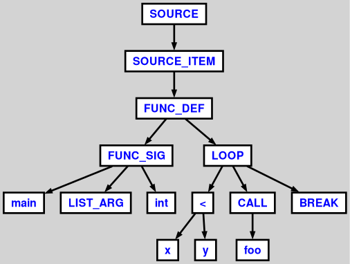

# Лабораторная работа №1
**Дисциплина:** Системное проргаммное обеспечение  
**Тема:** Работа с генераторами парсеров. Построение AST. Графическое представление AST.
**Выполнил:** Попов П.С.  
**Группа:** P4116  
**Преподаватель:** Кореньков Ю.Д.  
**Дата:** 26.09.2024

## Цели работы
1. Изучить программные средства для генерации парсеров.
2. Адаптировать под выбранное средство имеющуюся грамматику (вариант №4).
3. Построить графическое представление AST по подготовленному тестовому примеру.
## Ход работы 

1. Сборка из исходников и подключение [статической библиотеки](https://www.antlr3.org/api/C/index.html)Antlr3c Runtime Api к проекту на C.
2. Изучение документации
	- [ANTLR3_LEXER_struct Struct Reference](https://www.antlr3.org/api/C/struct_a_n_t_l_r3___l_e_x_e_r__struct.html) - класс для разбиения входных данных на токены.
	- [ANTLR3_PARSER_struct Struct Reference](https://www.antlr3.org/api/C/struct_a_n_t_l_r3___p_a_r_s_e_r__struct.html) - класс для выделения синтаксических конструкций по токенам. Построение AST.
	- [ANTLR3_BASE_TREE_ADAPTOR_struct Struct Reference](https://www.antlr3.org/api/C/struct_a_n_t_l_r3___b_a_s_e___t_r_e_e___a_d_a_p_t_o_r__struct.html)- класс для генерации .dot строки с представлением AST. 
	- [Graphviz](https://graphviz.org/) - инструмент для представления дерева в графическом формате (.png).
  3. Адаптация грамматики под Antlr3.
  4. Использование Antlr3c Runtime Api для генерации дерева, а также <stdlib.h> для системных вызовов компилятора antlr и graphviz.
## Структура программы
- Грамматика `Var4.g`
- Компилятор `antlr-3.4-complete`
- `Var4Lexer.c`, `Var4Lexer.h`, `Var4Parser.c`, `Var4Parser.h`, `main.c`, `Treebuilder.h`, `Treebuilder.c`
Для описания структуры программы приведу описание заголовка `Treebuilder.h`, содержащего основную логику программы.
```cpp
typedef struct ParseResult {
    pANTLR3_INPUT_STREAM is;
    pVar4Lexer l;
    pANTLR3_COMMON_TOKEN_STREAM ts;
    pVar4Parser p;
    Var4Parser_source_return sr;
} ParseResult;

typedef ParseResult* pParseResult;

char* readFileToString(const char* filePath);

pParseResult parse(const char* text);

void generateDot(pParseResult result, const char* path);

int cleanup(ParseResult* pr);
```
1. `ParseResult` - структура, содержащая необходимый минимум Antlr3c Runtime Api объектов для обработки тестового примера.
2. `readFileToString` - возвращает `char*` содержимой входного файла.
3. `parse` - метод по заданной сигнатуре. Возвращает разбитое на токены AST.
4. `generateDot` - генерирует `.dot` файл для дальнейшего графического представления AST.
5. `cleanup` - для корректной очистки ресурсов и избежания утечек памяти при работе с Antlr3c Runtime Api.
## Тестовый пример
Следующий пример использовался для проверки работоспособности написанной программы.
```
def calculateSum(a of int array[5], beta of boolean) of int
  beta = true;
  while (3 < 5)
    begin
      psi = phi - kappa;
    end
  end
  {
    j = x + y;
    if g < h then
      break;
  } until a < b;
  brt = (x) + (2 * y);
  foo(x+t, 2+2);
  int x = (z+t) + 4 * (6+7);
  uint t;
  int array[3] x = y[3];
  meta = z[3..5];
end
```
## Результаты
1. Реализован программный модуль, генерирующий графическое представление AST по файлу с программой на языке, описанном заданной грамматикой `Var4.g`. 
2. Построенное AST:

## Выводы
1. Изучено средство синтаксического анализа Antlr3.
2. Изучен общий подход работы Antlr3c Runtime Api.
4. Создана программа, позволяющая выполнить построение AST по заданным исходникам обрабатываемой программы. 